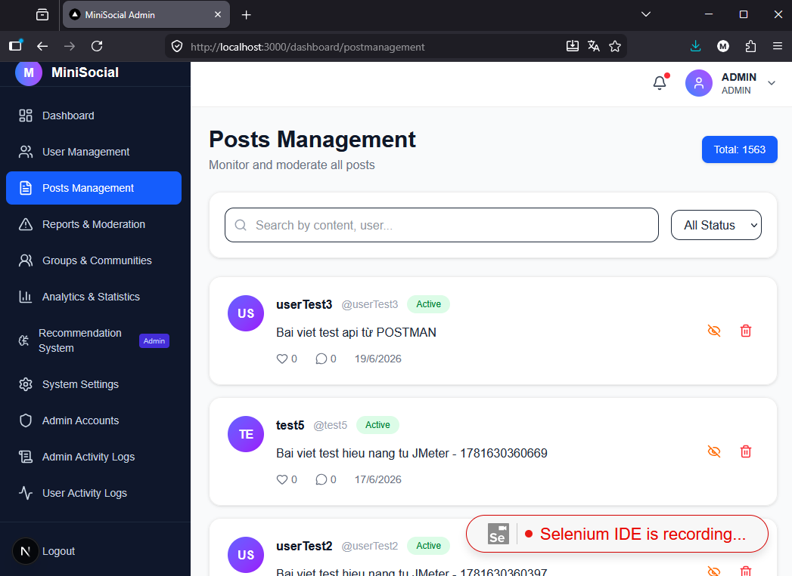
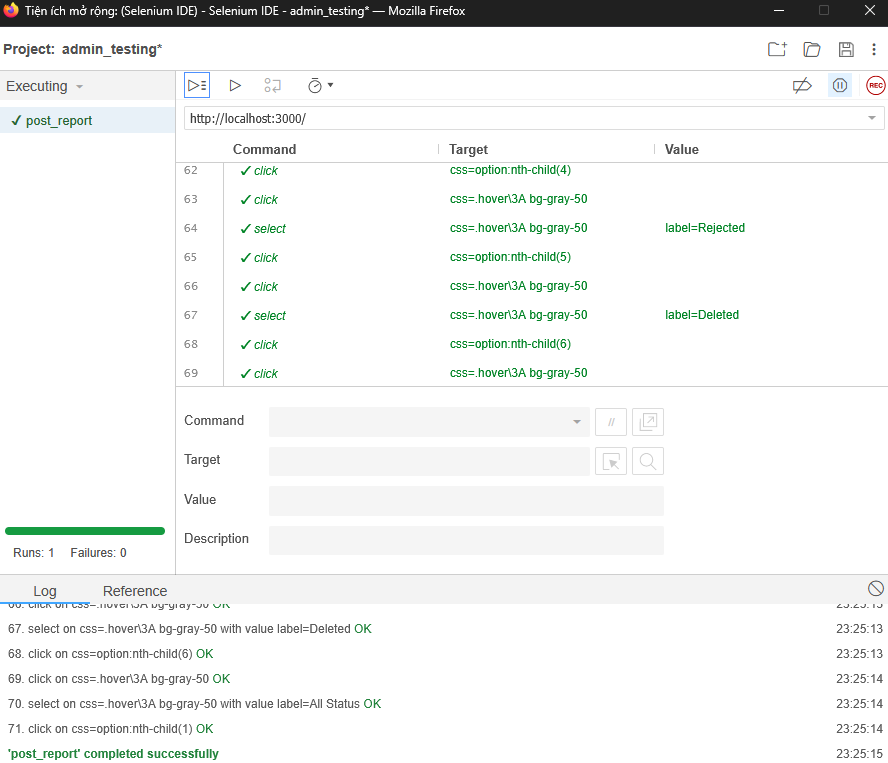

# Kiểm thử giao diện với Selenium IDE — MiniSocial Admin

## 1. Giới thiệu

Selenium IDE là một extension hỗ trợ kiểm thử tự động theo phương thức **ghi và phát lại (record & playback)**, được tích hợp dưới dạng tiện ích mở rộng trên trình duyệt Firefox. Công cụ cho phép người kiểm thử ghi lại trực tiếp các hành động thao tác trên giao diện web (click, nhập dữ liệu, chọn lựa chọn trong dropdown...) mà không cần viết code, sau đó tự động chuyển các hành động này thành các bước test case dạng bảng gồm `Command`, `Target`, `Value`. Mỗi bước được Selenium IDE tự sinh selector (thường ở dạng CSS hoặc XPath) để định danh phần tử trên trang.

Trong đề tài này, Selenium IDE trên Firefox được sử dụng để kiểm thử bổ sung cho các chức năng quản trị của hệ thống MiniSocial Admin, cụ thể là chức năng **Posts Management**, với các thao tác như lọc trạng thái bài viết (Active, Pending, Rejected, Deleted...), tìm kiếm bài viết, ẩn/hiện và xóa bài viết. Sau khi ghi lại các bước, test case có thể được lưu lại trong một project (`admin_testing`) và chạy lại nhiều lần để kiểm tra tính ổn định của giao diện qua các lần cập nhật hệ thống, giúp phát hiện sớm lỗi hồi quy (regression) mà không cần thực hiện kiểm thử thủ công lặp lại.

## 2. Môi trường thực hiện

| Thành phần | Thông tin |
|---|---|
| Trình duyệt | Mozilla Firefox |
| Extension | Selenium IDE |
| Project | `admin_testing` |
| Test case | `post_report` |
| Trang kiểm thử | `http://localhost:3000/dashboard/postmanagement` |
| Hệ điều hành | Windows 11 |

## 3. Quy trình thực hiện

1. Mở extension Selenium IDE trên Firefox, tạo project mới `admin_testing`.
2. Đăng nhập vào hệ thống MiniSocial Admin trước khi bắt đầu ghi để đảm bảo truy cập được trang quản trị (route được bảo vệ bởi xác thực).
3. Bấm **Record**, di chuyển đến trang **Posts Management**.
4. Thực hiện các thao tác cần kiểm thử: chọn các trạng thái lọc bài viết (Pending, Rejected, Deleted, All Status...), click vào các phần tử dropdown và option tương ứng.
5. Dừng ghi, lưu lại test case với tên `post_report`.
6. Chạy lại (**Playback**) toàn bộ test case để kiểm tra tính ổn định của các bước đã ghi.

## 4. Hình ảnh minh họa

### 4.1. Ghi lại thao tác trên trang Posts Management

*Selenium IDE đang ghi lại (recording) các hành động trên trang Post Management thực tế của hệ thống, thể hiện qua thông báo "Selenium IDE is recording..." ở góc phải trang, trong khi danh sách bài viết cùng các nút ẩn/xóa được hiển thị bên dưới.*

### 4.2. Danh sách các bước test case đã ghi

*Danh sách các bước trong test case `post_report` thuộc project `admin_testing`, thể hiện chuỗi lệnh `click` và `select` dùng để chọn các tuỳ chọn lọc trạng thái bài viết (Pending, Rejected...) thông qua dropdown `.bg-white > .border`.*

### 4.3. Kết quả chạy test case

*Kết quả thực thi (playback) test case `post_report`, với toàn bộ các bước đều có dấu ✓ màu xanh, tổng kết `Runs: 1, Failures: 0` và thông báo `'post_report' completed successfully`, cho thấy chức năng lọc trạng thái bài viết trên giao diện hoạt động đúng như mong đợi.*

## 5. Nhận xét

- Selenium IDE phù hợp để kiểm thử nhanh giao diện mà không cần viết code, đặc biệt hữu ích cho việc kiểm thử hồi quy (regression testing) các thao tác lặp lại trên cùng một trang.
- Một số hạn chế đã gặp trong quá trình thực hiện:
  - Lỗi tương thích `initKeyEvent is not a function` khi dùng lệnh `type`/`sendKeys` trên phiên bản Firefox mới, do API giả lập bàn phím cũ đã bị Firefox loại bỏ.
  - Selector được Selenium IDE tự sinh (ví dụ `css=.bg-white > .border`, `css=option:nth-child(4)`) phụ thuộc vào cấu trúc DOM và thứ tự phần tử, dễ bị sai lệch nếu giao diện được thay đổi (thêm/xóa phần tử, đổi class CSS).
- Để khắc phục và tăng độ ổn định lâu dài, nên bổ sung thuộc tính `data-testid` cho các phần tử quan trọng trên giao diện, hoặc export test case sang code Selenium WebDriver (Python/Java) để chủ động kiểm soát selector và xử lý các tình huống đặc biệt như `window.confirm()`/`window.alert()`.